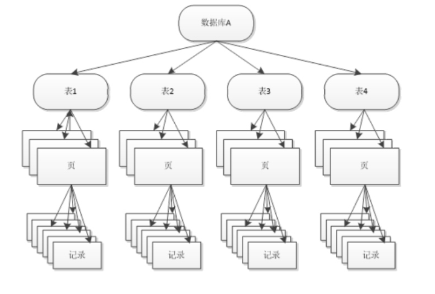
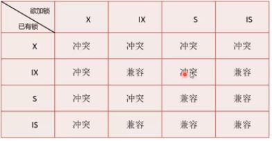

## InnoDB Lock
一、InnoDB锁的类型
- 1、标准的行级锁
- a、共享锁（S Lock） 
- b、排它锁 (X Lock)
```
解释：如果一个事务T1已经获得了行r的共享锁，那么另外的事务T2可以立即获得行r的共享锁，因为读取并没有改变行r的数据，这种情况为锁兼容（Lock Compatible）
但若有其他的事务T3想获的行r的排它锁，则必须等待事务T1、T2释放行r上的共享锁---这种情况成为锁不兼容。
排它锁与共享锁的兼容性
      X       S
X   不兼容   不兼容
S   不兼容    兼容
上表为同一行数据的兼容性
````
# InnoDB 支持多粒度锁定
````
颗粒度锁定允许事务在行级上的锁和表级上的锁同时存在。为了支持在不同颗粒度上进行加锁操作，InnoDB存储因为支持一种额外的锁方式，称之为意向锁（Intention Lock）
意向锁是将锁定的对象分为多个层次，意向锁意味着事务希望在更细粒度（fine grantularity）上进行加锁。
如下图
````
- 

````
  如果将上锁的对象看成一棵树，那么对最下层的对象上锁，也就是对最细颗粒度的对象进行上锁，那么首先需要对粗颗粒度的对象上锁。如上图所示，如果需要对page上的记录r进行上X锁，那么分别对数据库 、表、page上意向锁IX，最后对记录r上X锁。若其中任何一个部分导致等待，那么改操作需要等待粗粒度锁的完成。
  eg:在对记录r上加X锁之前，已经有事务对表1进行了S锁，那么表1上已经存在S锁，之后事务需要对记录r在表1上加IX，由于不兼容，所以改事务需要等待表锁操作的完成。
# InnoDB 意向锁的类型
- InnoDB存储引擎支持意向锁设计比较简练，其意向锁即为表级别的锁。设计目的主要是为了在一个事务中揭示下一行将被请求的锁类型。其支持两种意向锁：
- 1、意向共享锁（IS Lock）,事务想要获得一张表中某几行的共享锁
- 2、意向排它锁（IX Lock），事务想要获得一张表中某几行的排它锁
- 由于InnoDB存储引擎支持的是行级的锁，因此意向锁其实不会阻塞除全表扫以外的任何请求。故表级意向锁与行级锁的兼容性如下图
- 
- 用户可以通过 ：show engine innodb status\G 来观察锁的情况
- 官方锁介绍连接
- https://dev.mysql.com/doc/refman/5.7/en/innodb-locking.html#innodb-shared-exclusive-locks
# InnoDB 锁监控语句
- mysql>show engine innodb status\G
- mysql>select * from information_schema.innodb_trx\G
- https://dev.mysql.com/doc/refman/5.7/en/innodb-trx-table.html
- mysql>select * from information_schema.innodb_locks\G
- https://dev.mysql.com/doc/refman/5.7/en/innodb-locks-table.html
- mysql>select * from information_schema.innodb_lock_waits\G
- https://dev.mysql.com/doc/refman/5.7/en/sys-innodb-lock-waits.html


